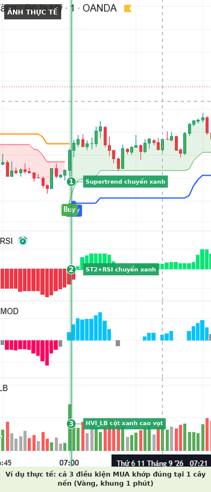
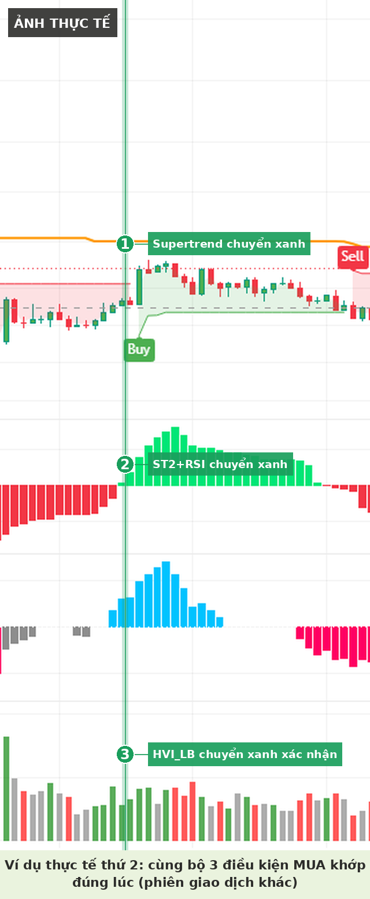
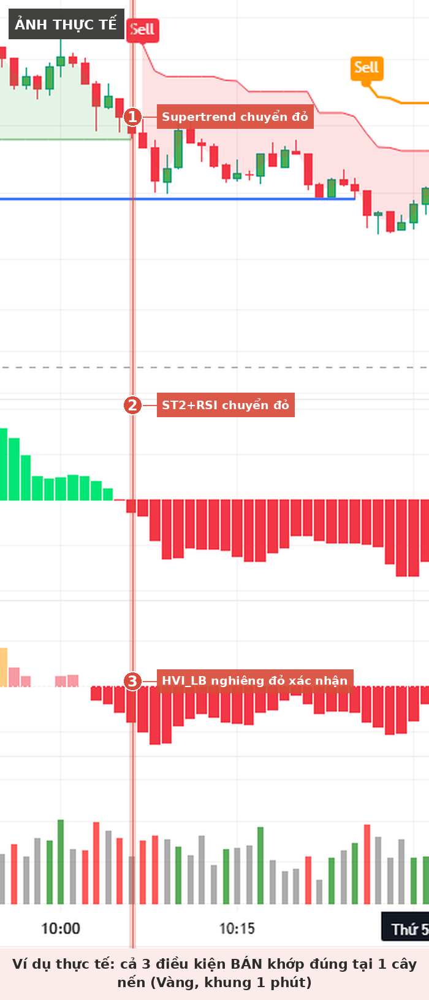
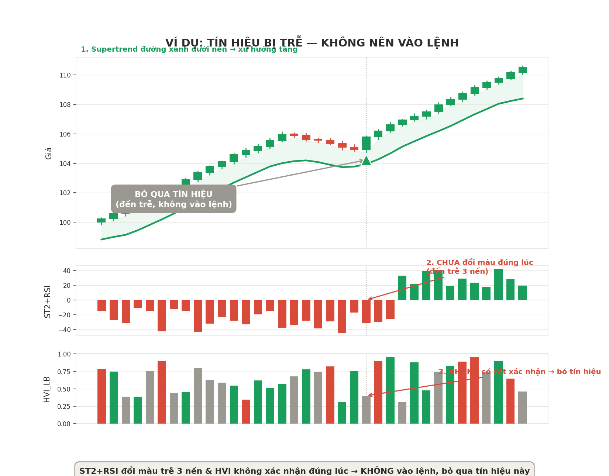

# Chiến lược Supertrend cải tiến — Cấu hình A (Supertrend + ST2+RSI + HVI_LB)

Tài liệu này mô tả chi tiết bộ quy tắc giao dịch dựa trên 3 chỉ báo: **Supertrend**, **ST2+RSI** (histogram động lượng), và **HVI_LB** (Volume của Lazy Bear). Đây là phiên bản cải tiến từ chiến lược Supertrend gốc, thay thế QQE MOD bằng ST2+RSI để giảm nhiễu tín hiệu và tránh trùng lặp thông tin giữa các chỉ báo.

> ⚠️ **Lưu ý quan trọng:** Đây là tài liệu tổng hợp mang tính giáo dục và ghi chú cá nhân, không phải lời khuyên đầu tư. Kết quả backtest trong quá khứ không đảm bảo hiệu suất tương lai. Luôn tự kiểm chứng chiến lược bằng backtest/forward-test trước khi dùng vốn thật.

> 📌 **Về hình ảnh minh họa:** Các ảnh đánh dấu "ẢNH THỰC TẾ" được crop trực tiếp từ chart giao dịch thật (TradingView/OANDA) đã backtest, có đánh số 1-2-3 chỉ rõ từng điều kiện. Ảnh còn lại (ví dụ tín hiệu bị trễ) là ảnh dựng lại mang tính minh họa cho quy tắc, không phải chart thật.

---

## Mục lục

1. [Cài đặt chỉ báo](#1-cài-đặt-chỉ-báo)
2. [Quy tắc vào lệnh MUA (Long)](#2-quy-tắc-vào-lệnh-mua-long)
3. [Quy tắc vào lệnh BÁN (Short)](#3-quy-tắc-vào-lệnh-bán-short)
4. [Quản lý vốn](#4-quản-lý-vốn)
5. [Những trường hợp KHÔNG vào lệnh](#5-những-trường-hợp-không-vào-lệnh)
6. [Vì sao bỏ QQE MOD, dùng ST2+RSI](#6-vì-sao-bỏ-qqe-mod-dùng-st2rsi)
7. [Nhật ký backtest](#7-nhật-ký-backtest)
8. [Lịch sử thay đổi](#8-lịch-sử-thay-đổi)

---

## 1. Cài đặt chỉ báo

| Chỉ báo | Vai trò | Cài đặt |
|---|---|---|
| **Supertrend** | Xác định xu hướng chính | ATR Period = 20, ATR Multiplier = 5 |
| **ST2+RSI** | Bộ lọc động lượng (thay QQE MOD) | Cột xanh = động lượng tăng, cột đỏ = động lượng giảm |
| **HVI_LB** (Lazy Bear Volume) | Bộ lọc khối lượng, xác nhận cuối cùng | Giá trị 1.5 |

---

## 2. Quy tắc vào lệnh MUA (Long)

Cần đủ **cả 3 điều kiện** sau, xảy ra cùng lúc hoặc trễ tối đa 1–2 nến:

1. **Supertrend đang ở trạng thái tăng** — đường xanh nằm dưới nến
2. **ST2+RSI chuyển sang màu xanh** — động lượng chuyển từ giảm sang tăng
3. **HVI_LB xuất hiện cột màu xanh lá** — xác nhận có lực mua thực sự, không phải tăng ảo

### Ảnh thực tế minh họa

*Ảnh chụp thực tế trên Vàng (XAU/USD), khung 1 phút — cả 3 điều kiện khớp đúng tại cùng 1 cây nến: Supertrend chuyển xanh (1), ST2+RSI chuyển xanh (2), HVI_LB có cột xanh cao vọt xác nhận (3).*

*Ảnh chụp thực tế thứ 2, phiên giao dịch khác — cùng bộ 3 điều kiện lặp lại chính xác, cho thấy tính nhất quán của quy tắc.*

---

## 3. Quy tắc vào lệnh BÁN (Short)

Ngược lại hoàn toàn với lệnh mua, cần đủ cả 3 điều kiện:

1. **Supertrend đang ở trạng thái giảm** — đường đỏ nằm trên nến
2. **ST2+RSI chuyển sang màu đỏ** — động lượng chuyển từ tăng sang giảm
3. **HVI_LB xuất hiện cột màu đỏ** — xác nhận lực bán thực sự

### Ảnh thực tế minh họa

*Ảnh chụp thực tế trên Vàng (XAU/USD), khung 1 phút — cả 3 điều kiện khớp đúng tại cùng 1 cây nến: Supertrend chuyển đỏ (1), ST2+RSI chuyển đỏ (2), HVI_LB nghiêng đỏ xác nhận (3).*

---

## 4. Quản lý vốn

- **Stop loss (Lệnh mua):** đặt tại đáy gần nhất trước điểm vào lệnh (swing low)
- **Stop loss (Lệnh bán):** đặt tại đỉnh gần nhất trước điểm vào lệnh (swing high)
- **Take profit:** luôn bằng **1.5 lần** khoảng cách từ giá vào lệnh đến stop loss (risk-reward = 1 : 1.5)

---

## 5. Những trường hợp KHÔNG vào lệnh

| # | Trường hợp | Hành động |
|---|---|---|
| 1 | ST2+RSI đổi màu nhưng HVI_LB **không xác nhận cùng lúc** | Bỏ qua tín hiệu, **không chờ** nến sau |
| 2 | Giá đi ngang, nến nhỏ, lộn xộn (sideway) | Không vào lệnh dù có tín hiệu, vì dễ bị pullback quét stop loss |
| 3 | Supertrend **chưa** đổi màu nhưng 2 chỉ báo còn lại đã đổi | Chưa đủ điều kiện — Supertrend là bộ lọc xu hướng chính, phải xác nhận trước |
| 4 | Có tín hiệu ngược chiều Supertrend dù 2 chỉ báo còn lại mạnh | Không vào lệnh — luôn ưu tiên xu hướng chính |

*Hình trên là ảnh minh họa (dựng lại) cho trường hợp KHÔNG nên vào lệnh — ST2+RSI đổi màu trễ 3 nến sau điểm Supertrend xác nhận, và HVI_LB không có cột xác nhận đúng lúc. Đây là tín hiệu nên bỏ qua, không chờ đợi để vào trễ.*

---

## 6. Vì sao bỏ QQE MOD, dùng ST2+RSI

- QQE MOD và RSI đều bắt nguồn từ cùng một logic tính toán (QQE MOD thực chất là RSI được làm mượt thêm qua ATR-smoothing) → giữ cả 2 gây trùng lặp thông tin, không tăng thêm giá trị.
- Qua đối chiếu nhiều khung giờ thực tế, ST2+RSI phản ứng **nhanh và dứt khoát hơn** tại các điểm đảo chiều quan trọng, trong khi QQE MOD có xu hướng "do dự" (nhiều đoạn màu nhạt) trước khi xác nhận.
- Bỏ QQE MOD giúp có thêm "chỗ trống" để giữ **HVI_LB** làm bộ lọc khối lượng độc lập — vốn là chỉ báo mang giá trị thông tin mới thực sự (không tính từ giá như 2 chỉ báo động lượng còn lại).

---

## 7. Nhật ký backtest

Dùng bảng này để ghi lại kết quả mỗi lần backtest / forward-test, giúp so sánh hiệu suất theo thời gian.

| Ngày test | Cặp tiền / khung thời gian | Số lệnh | Tỷ lệ thắng | Profit factor | Drawdown lớn nhất | Ghi chú |
|---|---|---|---|---|---|---|
| | | | | | | |
| | | | | | | |
| | | | | | | |

---

## 8. Lịch sử thay đổi

| Phiên bản | Thay đổi |
|---|---|
| v1.0 | Chiến lược Supertrend gốc (2 Supertrend), win rate 56%, profit factor 1.91 |
| v2.0 | Thêm HVI_LB + QQE MOD thay 1 Supertrend, win rate 65%, profit factor 2.79 |
| v3.0 (Cấu hình A) | Thay QQE MOD bằng ST2+RSI, đang trong giai đoạn backtest — xem mục 7 |

---

*Tài liệu được tổng hợp và biên soạn cho mục đích ghi chú cá nhân và tham khảo khi backtest chiến lược.*
